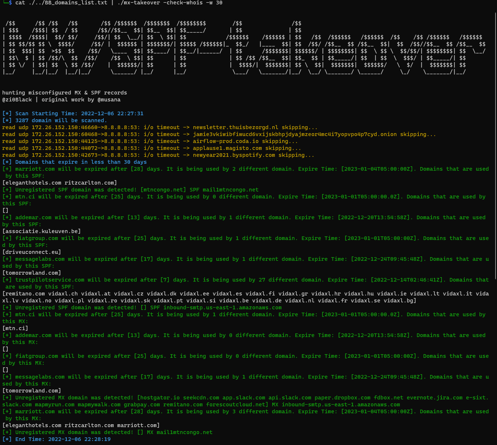

<h1 align="center">
  mx/spf-takeover
  <br>
</h1>


<p align="center">
  <a href="https://pkg.go.dev/github.com/musana/mx-takeover#section-readme"></a>
  <a href="https://goreportcard.com/report/github.com/musana/mx-takeover"></a>
  <a href="https://opensource.org/licenses/MIT"></a>
  <a href="https://twitter.com/zi0Black"></a>
  <a href="https://twitter.com/musana"></a>
</p>

<p align="center">
  <a href="#features">Features</a> •
  <a href="#installation-instructions">Installation</a> •
  <a href="#usage">Usage</a>
</p>


**mx/spf-takeover** focuses DNS records and detects misconfigured MX 6 SPF records. It currently supports three technique. These are,
- MX/SPF domains that will expire soon
- Unregistered MX domains
- Unregistered SPF domains

# Features

<h1 align="center">
  </a>
  <br>
</h1>

 - Domains deleted in mailgun but MX records held
 - Reclaiming domain automatically
 - Unregistered/expire MX domain
 - MX Domain that will expire soon
 - Domains that used same MX records
 - Saving scan results as json format
 - Support for concurrency


# Installation Instructions

mx-spf-takeover requires **go1.17** to install successfully. Run the following command to install.

```sh
go install -v github.com/zi0Black/mx-spf-takeover@latest
```

# Usage

```sh
mx-spf-takeover -h
```

This will display help for the tool.


```console
┌──(root㉿kali)-[/home/mx-spf-takeover]
└─# mx-spf-takeover -h


 /$$      /$$ /$$   /$$       /$$ /$$$$$$  /$$$$$$$  /$$$$$$$$        /$$               /$$                                                        
| $$$    /$$$| $$  / $$      /$$//$$__  $$| $$__  $$| $$_____/       | $$              | $$                                                        
| $$$$  /$$$$|  $$/ $$/     /$$/| $$  \__/| $$  \ $$| $$            /$$$$$$    /$$$$$$ | $$   /$$  /$$$$$$   /$$$$$$  /$$    /$$ /$$$$$$   /$$$$$$ 
| $$ $$/$$ $$ \  $$$$/     /$$/ |  $$$$$$ | $$$$$$$/| $$$$$ /$$$$$$|_  $$_/   |____  $$| $$  /$$/ /$$__  $$ /$$__  $$|  $$  /$$//$$__  $$ /$$__  $$
| $$  $$$| $$  >$$  $$    /$$/   \____  $$| $$____/ | $$__/|______/  | $$      /$$$$$$$| $$$$$$/ | $$$$$$$$| $$  \ $$ \  $$/$$/| $$$$$$$$| $$  \__/
| $$\  $ | $$ /$$/\  $$  /$$/    /$$  \ $$| $$      | $$             | $$ /$$ /$$__  $$| $$_  $$ | $$_____/| $$  | $$  \  $$$/ | $$_____/| $$      
| $$ \/  | $$| $$  \ $$ /$$/    |  $$$$$$/| $$      | $$             |  $$$$/|  $$$$$$$| $$ \  $$|  $$$$$$$|  $$$$$$/   \  $/  |  $$$$$$$| $$      
|__/     |__/|__/  |__/|__/      \______/ |__/      |__/              \___/   \_______/|__/  \__/ \_______/ \______/     \_/    \_______/|__/


hunting misconfigured MX & SPF records
@zi0Black | original work by @musana

  -check-whois
        Check whois for detecting unregistered mx domain or will be expire soon
  -expire-day int
        Estimated days for expiration (default 30)
  -h    help
  -output string
        Save output to file as json
  -show-only-mx
        show only that have mx records
  -v    Print all log
  -w int
        number of worker (default 8)

```